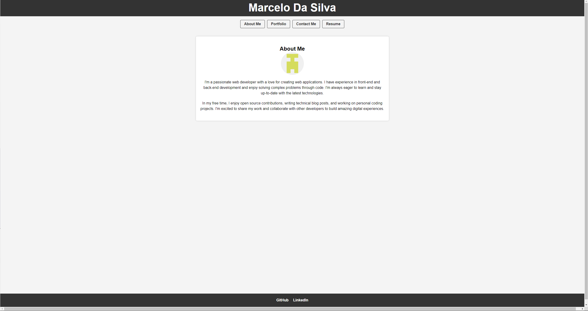
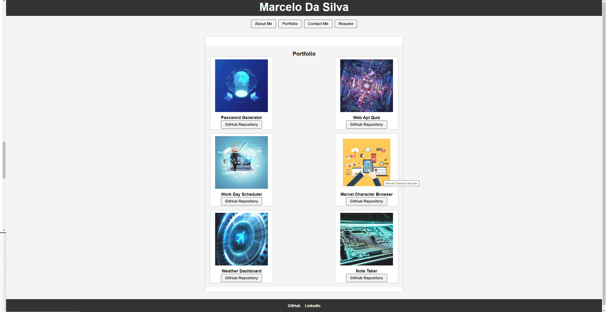

# Portfolio-App-Module20

## Description

This application is a single-page portfolio for web developers, providing an engaging and efficient way to showcase their work and interact with visitors. Key features include:

Header and Navigation: The portfolio features a clear header with the developer's name and navigation links to different sections: "About Me," "Portfolio," "Contact," and "Resume."

Smooth Transitions: Users can seamlessly switch between sections by clicking on navigation links without the page reloading, enhancing the overall user experience.

Default Selection: The "About Me" section is automatically selected when the portfolio is first loaded.

Content Sections: The "About Me" section offers a brief bio and a recent photo of the developer. In the "Portfolio" section, visitors can explore the developer's work with images and links to deployed applications and GitHub repositories. The "Contact" section provides a user-friendly contact form with input validation, and the "Resume" section includes a downloadable resume and a list of proficiencies.

Footer: The portfolio's footer contains links to the developer's profiles on GitHub and LinkedIn, as well as potentially on a third platform, like Stack Overflow or Twitter.

This single-page web developer portfolio app streamlines the presentation of a developer's work and contact information, making it easy for visitors to explore and connect.

###

Completion of the project was done with the help of Tutors